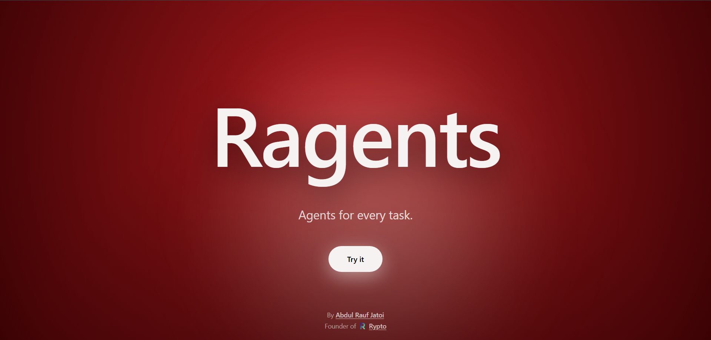
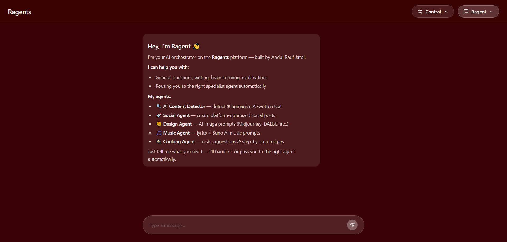
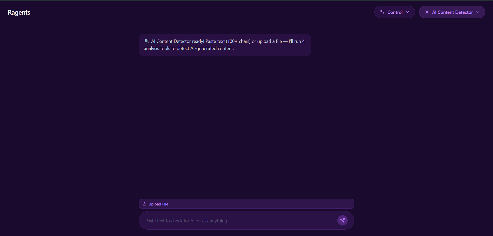
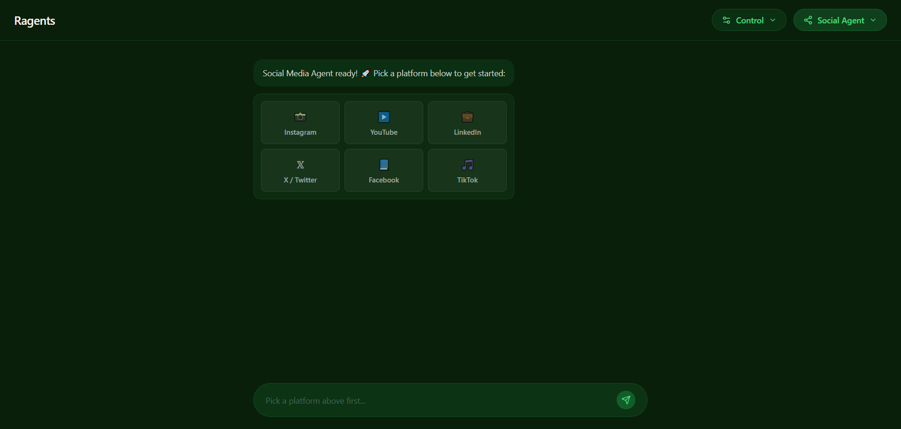
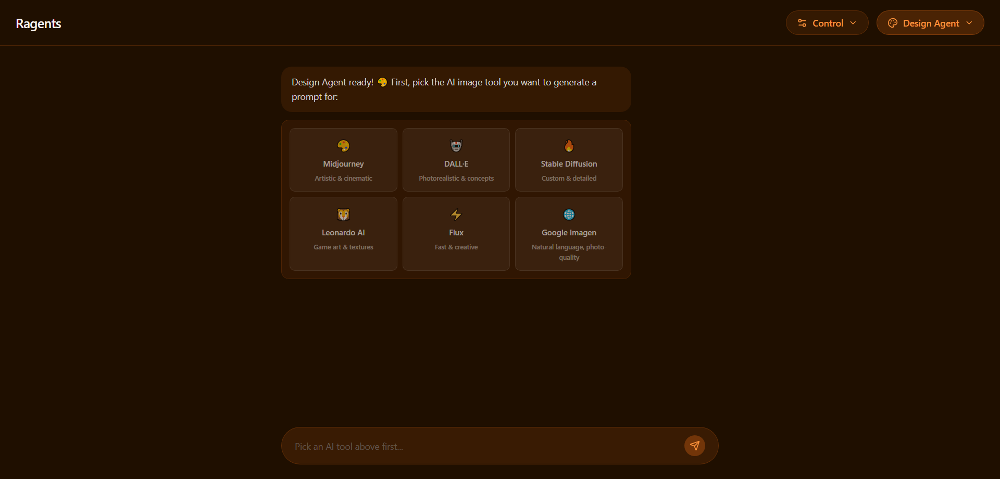
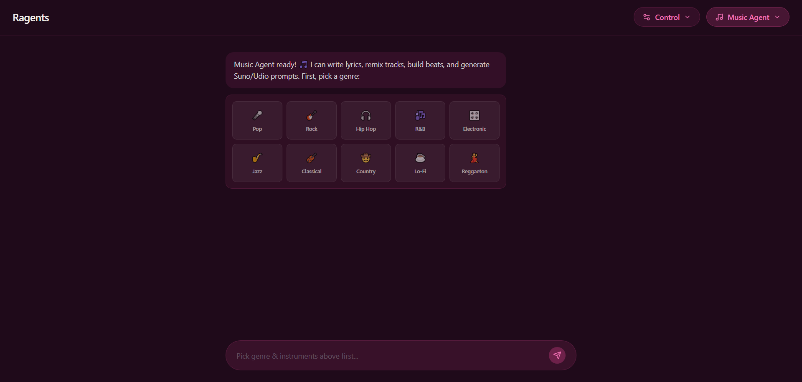
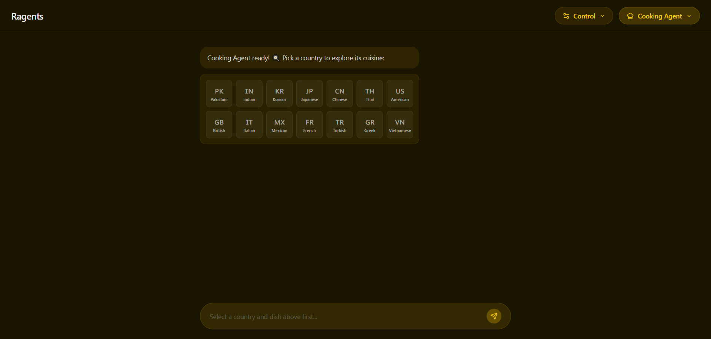
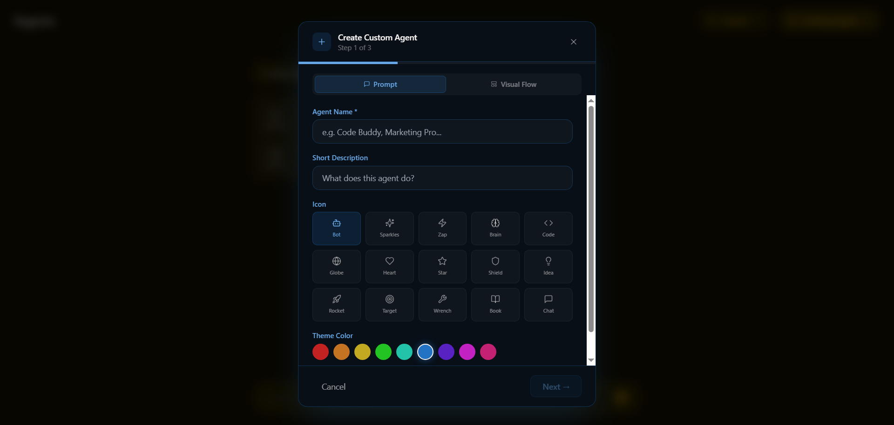

<div align="center">

# Ragents

**Agents for every task.**


</div>

---



---

## What's this?

Ragents is a multi-agent AI platform where each agent is built for a specific job. Instead of one generic chatbot trying to do everything, you get specialized agents that actually know what they're doing — whether that's writing social posts, generating image prompts, creating recipes, or even detecting AI-written text.

Pick an agent, do your thing. Simple as that.

> [!WARNING]
> **Still in development.** New agents, features, and improvements are actively being added. Things might change, break, or get better without notice.

---

## The Agents

<details open>
<summary><strong>Ragent — General Assistant</strong></summary>
<br>

The default agent. Ask it anything — writing, brainstorming, explanations, research. It also routes you to the right specialized agent when needed.



</details>

<details>
<summary><strong>AI Content Detector — Spot AI-written text</strong></summary>
<br>

Paste any text and it runs 4 checks: word pattern analysis, tone/style variance, structural uniformity, and AI phrase detection. Gives you a probability score. Can also humanize the text if it flags it.



</details>

<details>
<summary><strong>Social Agent — Platform-optimized posts</strong></summary>
<br>

Generates social media posts step by step — pick your platform (Instagram, LinkedIn, X, YouTube, TikTok, Facebook), choose a style, get a hook, body, hashtags, and a CTA. Each one tuned for that platform's culture.



</details>

<details>
<summary><strong>Design Agent — AI image prompts</strong></summary>
<br>

Builds optimized prompts for image generation tools. Select your style, aspect ratio, color theme, and subject — it outputs a prompt ready for Midjourney, DALL-E, Stable Diffusion, Leonardo AI, Flux, or Google Imagen.



</details>

<details>
<summary><strong>Music Agent — Lyrics & music prompts</strong></summary>
<br>

Pick a genre (30+ options), instruments, mood, and tempo. It writes lyrics (2 verses + chorus) and generates prompts for Suno AI and Udio so you can actually produce the track.



</details>

<details>
<summary><strong>Cooking Agent — Recipes on demand</strong></summary>
<br>

Choose a cuisine (14 countries), a dish, and your available ingredients. Get a full recipe with cook time, difficulty, servings, step-by-step instructions, and pro tips.



</details>

<details>
<summary><strong>Custom Agent Builder — Build your own</strong></summary>
<br>

Create agents with a custom name, personality, system prompt, icon, color, and tools. Use the visual builder or just describe what you want and it builds one for you. Custom agents persist in your browser.



</details>

---

## Features at a glance

- 6 built-in specialized agents + unlimited custom agents
- Works with **Groq, OpenAI, Gemini, and Claude** — switch providers anytime
- Step-by-step interactive builders (not just a chatbox)
- Export/import support for documents
- Markdown rendering in all responses
- API keys stored locally, never sent anywhere else
- Fully responsive — works on mobile too

---

## Getting started

```bash
git clone https://github.com/raufjatoi/Ragents.git
cd Ragents
npm install
```

Copy the example env file and add your API keys:

```bash
cp .env.example .env
```

```env
VITE_GROQ_API_KEY=your_key_here
VITE_OPENAI_API_KEY=your_key_here      # optional
VITE_GEMINI_API_KEY=your_key_here      # optional
VITE_CLAUDE_API_KEY=your_key_here      # optional
```

> [!NOTE]
> You only need **one** API key to get started. Groq has a free tier and works great out of the box. You can also add keys directly from the settings panel in the app.

```bash
npm run dev
```

Open [http://localhost:5173](http://localhost:5173) and you're in.

---

## Stack

| Layer | Tech |
|---|---|
| Framework | React 18 + TypeScript |
| Build | Vite |
| Styling | Tailwind CSS + Radix UI |
| Animation | Framer Motion |
| AI Providers | Groq, OpenAI, Gemini, Anthropic |
| State | TanStack Query + localStorage |
| Docs | jsPDF, docx, pdfjs |

---

## Built by

**Abdul Rauf Jatoi** — [Portfolio](https://raufjatoi.vercel.app) · [Rypto](https://rypto-beta.vercel.app)

---

<div align="center">
<sub>Still cooking. More agents and features on the way.</sub>
</div>
